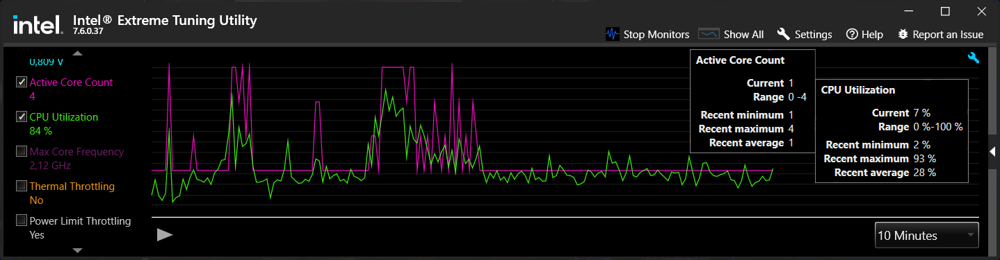
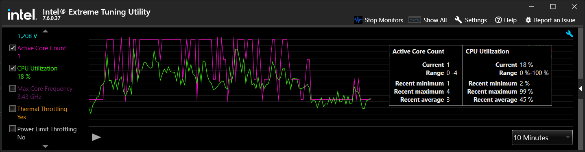

# Cake.ParallelExecution
A fairly simple solution to speed up your 🍰 [Cake](https://cakebuild.net/)  tasks using parallel execution

## Table of Contents

- [Overview](#overview)
- [Benchmarks](#benchmarks)
  - [Test bench](#test-bench)
  - [Time measurements](#time-measurements)
    - [Sequential run](#sequential-run)
    - [Parallel run](#parallel-run)
    - [Comparison](#comparison)
  - [CPU Utilization](#cpu-utilization)
    - [Sequential](#sequential)
    - [Parallel](#parallel)
    - [Comparison](#comparison-1)
- [How To Use](#how-to-use)
- [Pitfalls](#pitfalls)
- [Useful Tips](#useful-tips)

## Overview
Are you fed up with long running build processes? That's enough! Let's get rid of it. The proposed solution allows you to save lots of time during daily routines.
The steps are pretty easy:
  1. Review your Cake build process and find some independent and long running tasks. For instance, it might be separate build and deployment tasks for backend and frontend parts of the solution. Usually such tasks do not depend on the order of execution, nor on each other. So they can be started separately. Found some? Good. Now let's create a wrappers for them.
  2. Add new import for your `build.cake` script if it doesn't exist already:
``` cs
#addin nuget:?package=Cake.Powershell
```   
  3. Wrap your task(s) with a call to a new Powershell instance:
``` ps1
start powershell {.\\build.ps1 -Target 'Your-Task-Name'; echo 'Parallel task execution finished.'; Read-Host}
```
  4. Create a new *parallel* wrapper:
``` cs
// Initializes a task to run in parallel
Task("Init-Parallel-Your-Task-Name")
  .Does(() => {
    // Runs in parallel
    StartPowershellScript("start powershell {.\\build.ps1 -Target 'Your-Task-Name'; echo 'Parallel task execution finished.'; Read-Host}");
  });
```
  5. Replace your sequental task with the parallel one. 
Change:
``` cs
// Initializes a task to run in parallel
Task("Build")
    .IsDependentOn("Some-Task-Name")
    .IsDependentOn("Your-Task-Name")
    .IsDependentOn("Last-Task-Name");
``` 
   To:
``` cs
// Initializes a task to run in parallel
Task("Build")
    .IsDependentOn("Some-Task-Name")
    .IsDependentOn("Init-Parallel-Your-Task-Name")
    .IsDependentOn("Last-Task-Name");
``` 
  6. Replace any other parallelizable task if needed.

## Benchmarks
Let's compare sequential and parallelized runs of typical build and deployment process for web application. It consists of the 2 major tasks - backend and frontend.

### Test bench
I'm using a laptop with [Intel Core i5-10310U](https://ark.intel.com/content/www/ru/ru/ark/products/201892.html) processor which constantly suffers from 15W power limit. The difference may be even more significant, if you have let's say [AMD Ryzen 9 5950X](https://www.amd.com/ru/products/cpu/amd-ryzen-9-5950x#product-specs) with 16 cores/32 threads and no power limit. You are welcome to share your results in discussions.

| | |
|---|---|
| CPU | Intel Core i5-10310U |
| Cores | 4 |
| Threads | 8 |

### Time measurements

#### Sequential run
|Run|Time, mm:ss.ms|
|---|---| 
|1|08:03.1562279|
|2|08:07.0316733|
|3|08:59.2787849|
|4|08:34.0494476|
|5|08:37.1383982|
|AVERAGE|08:28.1300000|

#### Parallel run
|Run|Time, mm:ss.ms|
|---|---|
|1|05:50.4245998|
|2|06:33.5425879|
|3|06:24.1244980|
|4|06:31.0146683|
|5|06:55.8249122|
|AVERAGE|06:26.9800000|

#### Comparison
| Type | Average time, mm:ss.ms | Time saved, mm:ss.ms | Performance gain |
|---|---|---|---|
| Sequential | 08:28.13 508,13| 0 | 0 |
| Parallel   | 06:26.98 386,98| 02:01.15 | ~ 23% |

As you can see, we managed to save almost a quarter of the time using parallel tasks.
Moreover, the worst parallelized result still better than the best sequential with the minute break. It's 18% of time saving!

### CPU Utilization
Measurements have been taken from Intel Extreme Tuning Utility monitoring.

#### Sequential


#### Parallel


#### Comparison
| Type | Average active core | Average CPU utilization |
|---|---|---|
| Sequential | 1 | 28 % |
| Parallel   | 3 | 45 % |

It is clear that processor resources are used most efficiently with parallel tasks execution.

## How To Use
Explore `/examples/` folder to know how it works.

## Pitfalls
As it was mentioned earlier this solution is applicable to parallelizable and long-running tasks. If the task run time is less than Cake build time it may be better to leave it as is and run in a sequential order.

## Useful Tips
1. Try to determine which parallelizable task is the most long-running. If possible, leave it in a main powershell instance, so other parallel task(s) will finish faster even with Cake script build step.

2. If task dependencies tree is way too complex you can invoke parallel tasks from another parallel tasks. But don't forget about Cake script build process duration. Sometimes it's better to run small tasks sequentially. 
